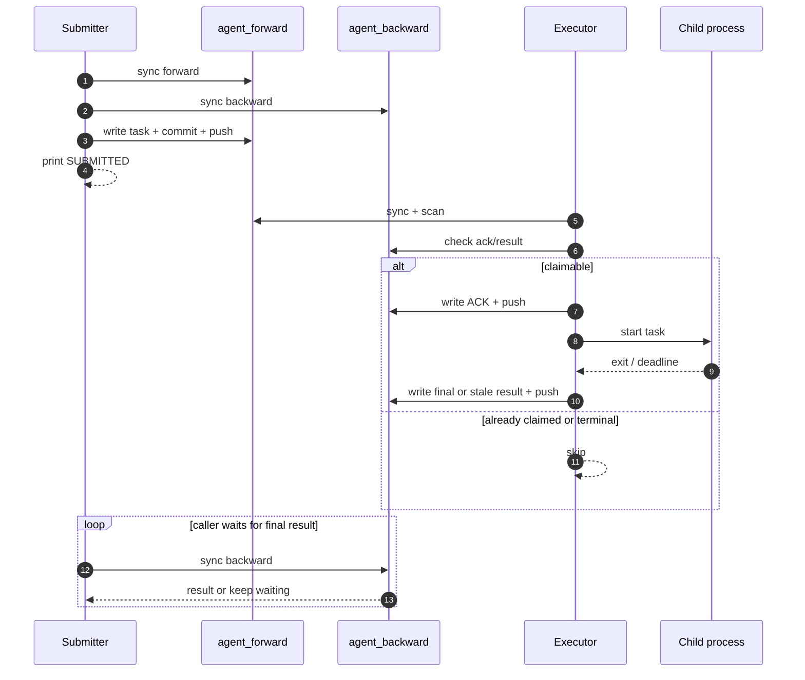
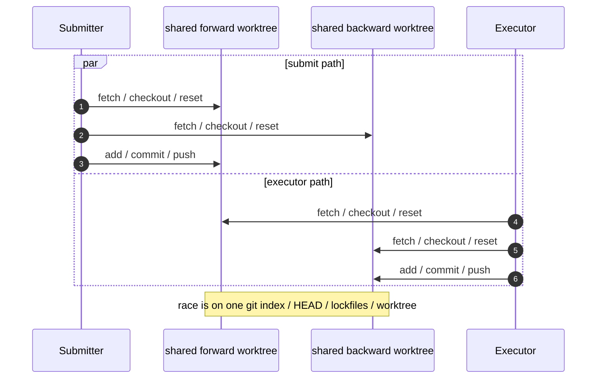

# Design

## Summary

`AgentExecTunnel` is a dual-repo execution tunnel:

- `agent_forward`
- `agent_backward`

Roles:

- submitter writes `agent_forward`, reads `agent_backward`
- executor reads `agent_forward`, writes `agent_backward`

Task truth is always in `agent_backward`.

Protocol states:

- no `ack`, no `result` => claimable
- `ack` only => already claimed
- `result` present => terminal
- `stale` is also terminal

The design assumes:

- multiple concurrent submitters may publish into forward
- exactly one executor is active for one forward/backward remote pair
- executor is a long-running loop
- transient network/git failures are normal
- submitter and executor use separate working clones

## Public Interfaces

Task submit:

```bash
python3 submitter/submit_powershell.py '<relay_command>'
python3 submitter/submit_powershell_ssh.py TARGET_HOST '<target_command>'
python3 submitter/submit_gitbash.py '<relay_command>'
python3 submitter/submit_gitbash_ssh.py TARGET_HOST '<target_command>'
```

Files:

```bash
python3 submitter/submit_files.py --name <user_name> --src <local_file_or_dir>
```

Executor:

```bash
python3 executor/run_executor.py
python3 executor/run_executor.py --once
```

Repair:

```bash
python3 tools/repair_task.py --task-id ... --clear-ack
python3 tools/repair_task.py --task-id ... --write-failed
```

## Repository Layout

Forward:

- `tasks/YYYY/MM/DD/HH/<task_id>.json`
- `files/<user_name>/...`

Backward:

- `acks/YYYY/MM/DD/HH/<task_id>.json`
- `results/YYYY/MM/DD/HH/<task_id>.json`

## Core Rules

- submitter syncs `forward` and `backward` before publish
- submitter waits only for final result, not for ACK
- executor does startup recovery from backward, then steady-state dispatch scans forward
- executor must durably publish ACK before starting task execution
- backward writes are serialized through one writer path
- executor retries git/network failures forever
- submitter publish is bounded-retry
- submitter result wait is bounded by caller timeout
- task timeout becomes one durable `stale` result

## Runtime Semantics

Relay and SSH are different submit wrappers, but executor runtime is the same:

- claim one task
- build one command
- execute it
- publish one final result

There is no protocol-level streaming output.
Current output visibility is:

- submitter prints `SUBMITTED` after durable publish
- executor captures output locally
- executor publishes one final tail snapshot in backward
- submitter learns output by polling for final result

## Timing / Scope

- steady-state scan window: `6h`
- startup catch-up window: `72h`
- git command timeout: `10s` per call

Interpretation:

- executor treats short git timeouts as retryable liveness failures
- submitter treats short git timeouts as bounded caller-side failures during publish
- caller timeout does not imply the task never ran

## Sequence: Publish / Claim / Finalize



Key points:

- ACK is the claim boundary
- final state is visible only through backward
- `ack only` is intentionally not auto-reclaimed

## Sequence: Executor Dispatcher / Writer Model

```mermaid
sequenceDiagram
    autonumber
    participant Loop as Executor loop
    participant F as forward clone
    participant W as single git writer
    participant BW as backward-write clone
    participant P as worker child

    Loop->>F: sync + scan
    Loop->>W: enqueue ACK
    W->>BW: write ACK + commit + push
    W-->>Loop: ACK durable
    Loop->>P: start async worker
    Loop-->>Loop: continue scanning
    P-->>W: final/stale payload
    W->>BW: write result + commit + push
```

Meaning:

- main loop is only the dispatcher
- worker owns `execute -> finalize`
- backward durability is serialized
- weak network slows progress, but should not kill executor

## Sequence: Why Shared Worktree Is Unsupported



Conclusion:

- same remotes: supported
- same working clone: not supported

## Weak Network Behavior

Submitter side:

- if publish never becomes durable, command never enters the system
- if publish succeeds but backward stays unreadable, caller may time out locally
- publish retries are bounded; caller waiting is also bounded

Executor side:

- sync/push failures are retried forever with backoff
- executor should survive disconnects and recover when network returns
- timeout writes `stale`; it does not crash the loop

Operationally, the visible symptoms of a bad network are:

- delayed task pickup
- delayed final result visibility
- caller timeout despite later completion
- `ack only` tasks after interrupted finalize

## Executor Scope

Current duplicate suppression is intentionally single-executor:

- startup recovery imports remote ACK/result state from backward once
- steady-state suppression then relies on recovered state plus local in-memory task sets
- the supported model is one active executor per forward/backward remote pair

## Fresh-Machine Model

Expected startup:

1. clone `AgentExecTunnel`
2. init submodules
3. run `python3 tools/bootstrap_repos.py`
4. run `python3 executor/run_executor.py`

Fresh-machine readiness depends on:

- submodule checkout layout
- reachable submodule origins
- working Python + git
- working SSH auth for GitHub remotes

## Current Validation Focus

The repository currently emphasizes:

- submit interface tests
- executor flow tests
- fresh-clone bootstrap coverage
- dual-checkout integration coverage
- local relay burst pressure runs

The burst tooling is especially useful because it exposes:

- forward publish contention
- backward result visibility latency
- concurrent submit behavior under weak network / remote git latency
