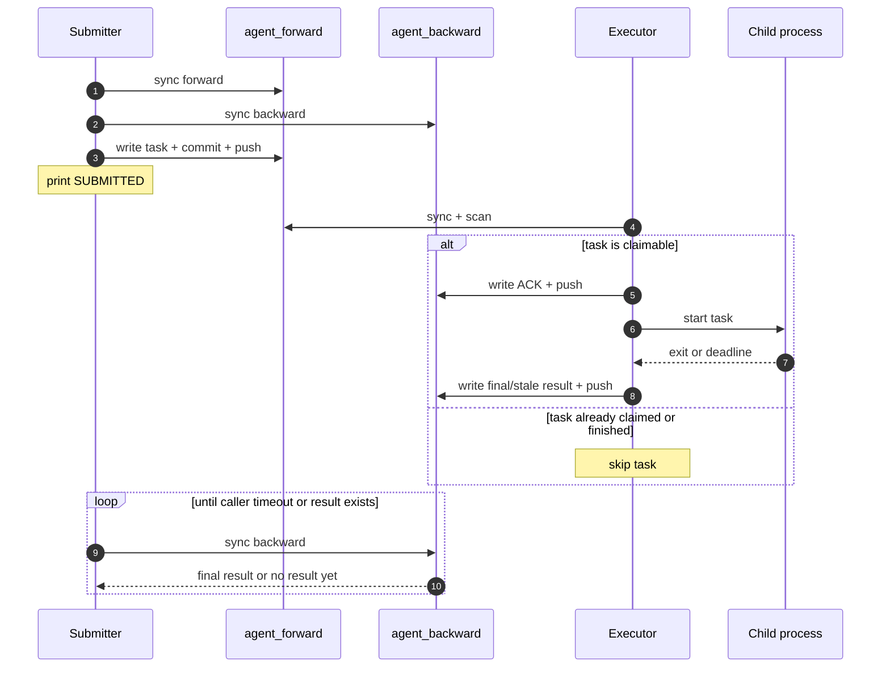
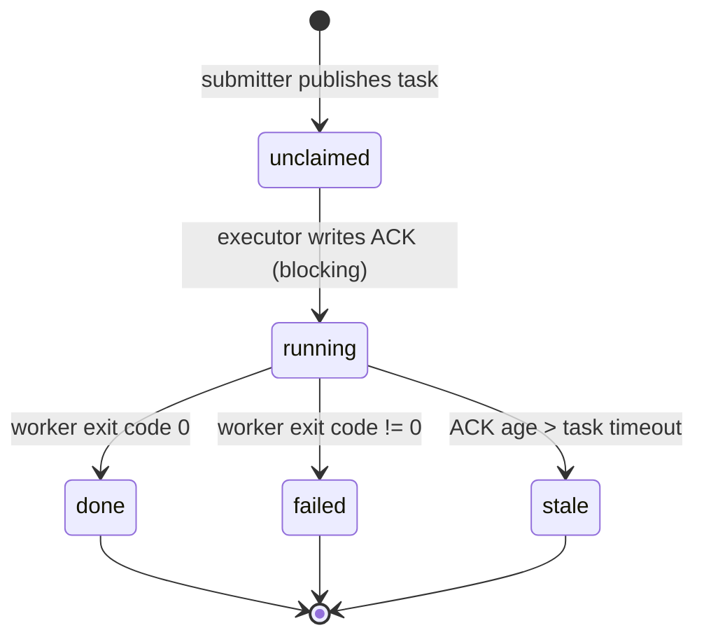
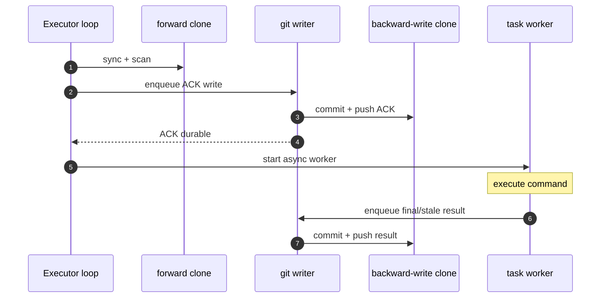

# Design

## Overview

`AgentExecTunnel` is a dual-repository command tunnel built around two data repos:

- `agent_forward`: submit-side publication channel
- `agent_backward`: executor-side acknowledgement and result channel

The system is designed for weak-network environments where Git connectivity may flap but later recover. The main goal is to keep the executor alive, keep task state durable, and avoid shared-worktree corruption.

## Goals

- Support multiple concurrent submitters publishing tasks into one forward repo
- Keep one long-running executor alive across transient Git and network failures
- Make task claim and task completion visible through durable Git commits
- Avoid running submitter and executor in the same Git worktree
- Keep the protocol simple: publish task, claim with ACK, publish final result

## Non-Goals

- Protocol-level streaming output
- Multi-executor coordination on the same forward/backward remote pair
- Shared-worktree submitter/executor deployment
- Strong exactly-once guarantees across multiple executors

## Architecture

### Repository Roles

- Submitter writes `agent_forward`
- Submitter reads `agent_backward`
- Executor reads `agent_forward`
- Executor writes `agent_backward`

Terminal task truth is always in `agent_backward`.

### Runtime Components

- `submitter/*.py`
  - build relay or SSH command wrapper
  - sync repos before publish
  - publish task
  - poll only for final result
- `executor/run_executor.py`
  - runs the long-lived executor loop
  - scans forward for claimable tasks
- `agent_exec_tunnel/executor.py`
  - dispatcher logic
  - durable ACK path
  - async worker lifecycle
  - single backward writer
- `agent_exec_tunnel/storage.py`
  - Git sync / commit / push primitives
- `agent_exec_tunnel/remotes.py`
  - data-repo URL resolution (env / file / defaults)
- `tools/bootstrap_repos.py`
  - clone or sync `agent_forward/` and `agent_backward/` next to the tunnel checkout
- `tools/run_burst_local_relay.py`
  - two isolated whole-repo local integration pressure test
- `tools/run_burst_live.py`
  - submit-pressure tool against an already-running remote executor

### End-to-End Flow

## Repository Layout

### Forward

- `tasks/YYYY/MM/DD/HH/<task_id>.json`
- `files/<namespace>/...`

### Backward

- `acks/YYYY/MM/DD/HH/<task_id>.json`
- `results/YYYY/MM/DD/HH/<task_id>.json`

### Repo-Local Data Directories

`agent_forward/` and `agent_backward/` sit inside the tunnel checkout but are **not** git submodules — they are gitignored sibling clones provisioned by `tools/bootstrap_repos.py`. They mutate on every task publication / ACK / result, so pinning their SHAs under a submodule parent would produce constant ghost-SHA drift. Remote URL resolution lives in `agent_exec_tunnel/remotes.py` (env vars → `.aet-remotes.json` → built-in defaults).

## Task State Model

A task has exactly three observable states. The backward repo is the only source of truth for which one the task is in.

| State | Backward signature | Meaning |
| --- | --- | --- |
| `unclaimed` | no ACK, no result | scan sees a publishable task, no executor has taken it yet |
| `running` | ACK exists, no result | an executor has taken it; it is either actively executing or orphaned from a prior executor run |
| terminal: `done` / `failed` / `stale` | result exists | one result record is durably committed; no further transitions |

The submitter never observes `running`; it polls only for the terminal record.

### Transitions

Only the `unclaimed -> running` edge is synchronous from the main loop's perspective: the dispatcher will not spawn a worker until the ACK commit is durable. All other edges are published by workers or by main-loop reconciliation, and the main loop does not block on them.

### Main-Loop Reconciliation

Each scan pass classifies every visible forward task into one of the three states by looking at backward, then:

- `unclaimed`: take the `unclaimed -> running` edge (ACK + spawn worker)
- `running` with a live in-memory worker: do nothing, the worker will finalize
- `running` without a live worker (orphan from a crashed executor run): compare ACK age to the task's own `timeout_seconds`. If exceeded, write a durable `stale` result; otherwise leave it alone and re-check next pass.
- terminal: skip

There is no fourth "permanently blocked" state. An ACK without an in-memory worker is always either still within the task's deadline (will be revisited) or past the deadline (will be stale-reconciled). Forward's two-hour scan window bounds how far back reconciliation looks — older orphans fall out of the window and stop appearing in scans, which is acceptable.

## Core Assumptions

- Multiple submitters may race to publish into `agent_forward`
- Exactly one executor is active for one forward/backward remote pair
- Submitter and executor run in separate working clones
- Transient Git failures are expected and must be retried
- Executor liveness is more important than immediate completion

## Submit Path

1. Build the final relay or SSH command string
2. Sync `agent_forward`
3. Sync `agent_backward`
4. Write task JSON into `agent_forward/tasks/...`
5. Commit and push task publication
6. Print `SUBMITTED ...`
7. Poll `agent_backward/results/...` until result or caller timeout

Important behavior:

- Submit publish is bounded-retry
- Submit-side waiting is bounded by caller timeout
- Caller timeout does not prove the task never ran

## Executor Path

1. Startup recovery syncs backward once
2. Executor scans recent forward task buckets
3. For each claimable task, publish durable ACK first
4. Only after durable ACK, start one async worker
5. Worker runs `execute -> finalize`
6. Final result is written durably to backward through the single writer

Important behavior:

- Steady-state dispatch syncs only `agent_forward`
- Backward writes are serialized
- Timeout becomes a durable `stale` result
- The main scan loop does not poll running child state

### Dispatcher / Worker / Writer

## Concurrency Model

### Submitter Concurrency

Concurrent submitters are supported at the remote-repo level.

They are **not** supported in one shared submitter worktree, because publication still uses Git operations that mutate one index / HEAD / lock set.

### Executor Concurrency

The runtime model is intentionally single-executor.

Why:

- startup imports backward ACK/result state once
- steady-state duplicate suppression then relies on local in-memory sets
- no distributed lease or compare-and-swap protocol exists across executors

Running multiple executors against the same forward/backward remotes is therefore out of scope.

### Why Shared Worktree Is Unsafe

Submitter and executor both run Git operations that mutate the index, HEAD, and `.git/` lockfiles — `fetch`, `checkout -B`, `reset --hard`, `add`, `commit`, `push`. Running both against one shared working directory races on those lockfiles even though the two roles touch disjoint logical paths (tasks vs acks/results). The conflict is on the worktree, not on the file content. Separate clones against the same remotes are the supported layout; the burst runners under `tools/` demonstrate this.

## Failure Model

### Weak Network

Submitter side:

- publish may fail before a task becomes durable
- result polling may fail even after the task was accepted
- caller may time out while the executor later still finishes the task

Executor side:

- fetch/push failures are retried forever with exponential backoff
- temporary disconnects must not terminate the process
- writer initialization and steady-state writes both retry until recovery

### Timeout

Task timeout is protocol-visible:

- the executor writes one durable `stale` result
- the local child process may still continue detached
- no second final result is later published

### Interrupted Finalize

If the executor is interrupted after ACK is durable but before the terminal result is durable, the task's backward signature is `ACK without result` — the `running` state of the task state machine.

On restart the new main loop does not permanently block these tasks. Each scan pass applies the reconciliation rule from the Task State Model: reclaim the live-worker case, and stale-reconcile the orphan-past-deadline case. There is no separate "ack only" limbo.

## Operational Constraints

### Supported

- Separate submitter and executor clones
- Same forward/backward remotes
- Multiple submitters
- Long-running executor under intermittent network failure

### Unsupported

- Shared submitter/executor worktree
- Multiple executors on one remote pair
- Streaming protocol output

## Timing and Retry Policy

- Executor poll backoff: `1s -> 2s -> 4s -> 8s`
- Executor Git command timeout: `10s`
- Submitter publish retry: bounded
- Executor sync/push retry: infinite
- Default task timeout: `512s`

## Validation Focus

The repository currently emphasizes:

- submit interface tests
- executor flow tests
- fresh-clone bootstrap coverage
- dual-checkout integration coverage
- local relay burst pressure runs
- live submit-pressure observation
