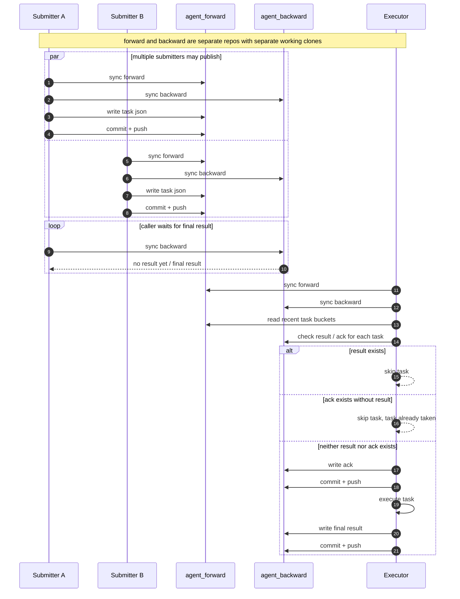
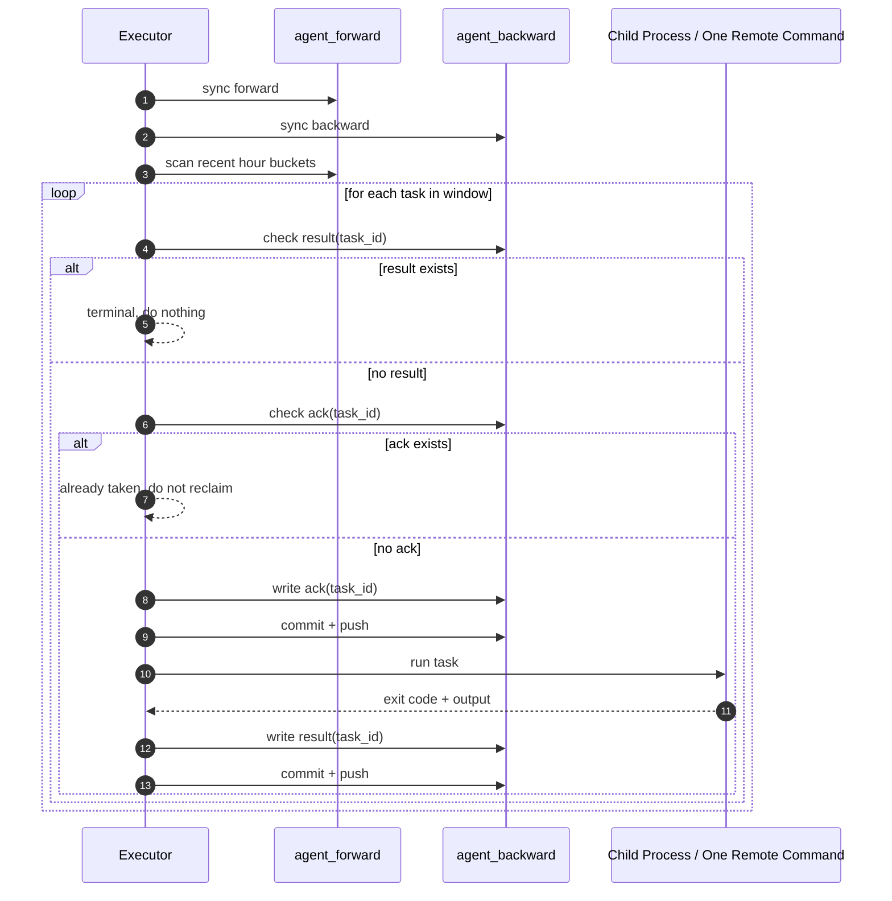

# Design

## Summary

`AgentExecTunnel` is the public control repository for a dual-data-repo execution tunnel:

- `agent_forward`
- `agent_backward`

Repository roles:

- submitter writes `agent_forward`, reads `agent_backward`
- executor reads `agent_forward`, writes `agent_backward`

This architecture does **not** assume a single submitter. Multiple submitters may concurrently publish tasks into forward.

The authoritative state of a task is always in `agent_backward`.

Protocol rules:

- if `result` exists in backward, the task is terminal
- if no `result` exists but `ack` exists in backward, the task has already been taken and must not be reclaimed
- only when neither `result` nor `ack` exists is the task claimable
- there is no `stale` result in this architecture

Task files are bucketed by hour so executor scan cost stays bounded.

## Public Interfaces

Task submit:

```bash
python3 submitter/submit_powershell.py '<relay_command>'
python3 submitter/submit_powershell_ssh.py TARGET_HOST '<target_command>'
python3 submitter/submit_gitbash.py '<relay_command>'
python3 submitter/submit_gitbash_ssh.py TARGET_HOST '<target_command>'
```

Shared file submit:

```bash
python3 submitter/submit_files.py --name <user_name> --src <local_file_or_dir>
```

Runtime meaning:

- relay submit and ssh submit are different wrapper interfaces at submit time
- once a task document exists in forward, executor treats both as the same class of work: one command to execute
- the only runtime difference is whether executor wraps the command in one relay-side `ssh TARGET_HOST ...`

Executor:

```bash
python3 executor/run_executor.py
python3 executor/run_executor.py --once
```

Repair:

```bash
python3 tools/repair_task.py --task-id ... --clear-ack
python3 tools/repair_task.py --task-id ... --write-failed
```

## Repository Layout

Forward:

- `tasks/YYYY/MM/DD/HH/<task_id>.json`
- `files/<user_name>/...`

Backward:

- `acks/YYYY/MM/DD/HH/<task_id>.json`
- `results/YYYY/MM/DD/HH/<task_id>.json`

`files/<user_name>/...` is a shared material channel. It is independent from task protocol objects.

## Why Synchronization Still Matters

Even though `agent_forward` and `agent_backward` are now single-purpose data repositories, synchronization still matters for correctness.

Reasons:

1. submitter must not decide whether a task was completed based on local memory or a stale local clone
2. executor must not decide whether a task is claimable based on a stale local clone
3. backward is the authority for `ack` and `result`, so every meaningful decision must be based on a recent backward sync
4. forward is the source of new tasks, so executor must sync forward before each scan pass
5. with multiple submitters, forward publication must tolerate concurrent git pushes and converge by retry/rebase

In other words:

- truth is not "what this process remembers"
- truth is not "what the local working tree happened to contain before fetch"
- truth is "what the current synced forward/backward repos say"

## Sequence: Repository Synchronization And Visibility



Key visibility rules:

- submitter never mutates backward
- executor never mutates forward
- executor must re-check backward before claiming a task
- caller completion is determined only by backward result visibility
- concurrent submitters are allowed, but each submitter must re-sync/rebase if its forward push races with another submitter

## Sequence: Executor Scan And State Update Model



State model:

- `no result + no ack` => claimable
- `ack only` => taken / suspended
- `result present` => terminal

There is no automatic conversion from `ack only` to `failed` or `stale`.

## Windows And Scan Scope

Steady-state scan window:

- recent `6h`

Startup catch-up window:

- recent `72h`

This means:

- routine scan cost stays bounded
- executor restart can still rediscover recent unfinished work
- old history outside the catch-up horizon is not scanned on every pass

## ACK Semantics

ACK is important for executor correctness, not just caller display.

Why:

- if executor only checked for final result, a task that was already taken by another executor but crashed before writing result would look "new"
- that would allow duplicate execution after restart

With ACK retained:

- `ack` marks that some executor path has already claimed the task
- a restarted executor must not treat that task as fresh
- duplicate execution is avoided by protocol rule, not by local memory

This architecture intentionally prefers:

- no duplicate execution

over:

- automatic takeover of ack-only tasks

Recovery of ack-only tasks is manual through repair tooling.

## Relay vs SSH Runtime Semantics

Relay and ssh are not two fundamentally different runtime task categories.

They differ at submit time:

- relay submit publishes the command as-is
- ssh submit publishes metadata that tells executor to add one relay-side ssh wrapper

But once executor has claimed the task, the runtime model is the same:

- take one task
- build one executable command string
- run it
- write one final result

So the core executor state model should be reasoned about as "one claimed command", not as two disjoint task systems.

## Weak-Network / Intermittent Disconnect Model

The system is designed for networks that may repeatedly disconnect or have long delays.

### Submitter under weak network

Submitter path:

1. sync forward
2. sync backward
3. write and push task into forward
4. poll backward for final result

Behavior under disconnect:

- if submitter cannot sync or push forward, the task is not published
- if a forward push races another submitter push, submitter must fetch/rebase/retry until it either publishes or gives up
- if submitter publishes the task but later cannot read backward, the caller may time out locally
- a caller timeout does not prove the task never ran
- backward remains the source of truth for eventual completion

### Executor under weak network

Executor path:

1. sync forward
2. sync backward
3. decide claimability using backward
4. push ack
5. run task
6. push result

Behavior under disconnect:

- if executor cannot sync forward/backward, that scan pass cannot make a trustworthy claim decision
- if executor cannot push ACK, it must not proceed as if the task was durably claimed
- if executor already wrote ACK but cannot later push result, the task remains `ack only`
- because `ack only` is not auto-reclaimed, the task is suspended until manual repair

This is intentional:

- weak network may delay progress
- weak network must not silently cause duplicate execution

### Practical consequence

Under very poor connectivity, the most likely visible symptoms are:

- delayed task pickup
- delayed final result visibility
- caller-side timeout even though the remote side may have progressed
- accumulation of ack-only tasks if executors can claim but cannot durably write final results
- temporary forward publish contention between multiple submitters

The repair tools exist specifically for this regime.

## Recommended Deployment Rule

Use separate working clones for:

- submitter
- executor

This matters even on the same machine.

Reason:

- if submitter and executor share one working clone, their git operations can interfere with each other
- separate working clones against the same remotes are the expected operating model

The local bare-remote integration test in this repository uses this exact separation.

## Fresh-Machine Startup Model

For a new machine, especially a new Windows executor host, the expected path is:

1. clone `AgentExecTunnel`
2. ensure sibling repos exist:
   - `../agent_forward`
   - `../agent_backward`
3. run:
   - `python3 tools/bootstrap_repos.py`
4. start executor:
   - `python3 executor/run_executor.py`

Bootstrap is expected to verify:

- tunnel repo exists
- sibling forward/backward repos exist
- submodules can initialize from relative URLs

Fresh-machine readiness therefore depends on:

- correct sibling repo layout
- submodule reachability
- a Python + git environment that can run the CLI scripts

## Current Test Backing

This repository currently has:

- protocol unit tests
- submit interface compatibility tests
- availability storage/report tests
- local integration tests using real bare git remotes
- a fresh-clone startup smoke path under test development
- fake-relay multi-roundtrip test path under test development
- a 30-second local burst stress path under test development
