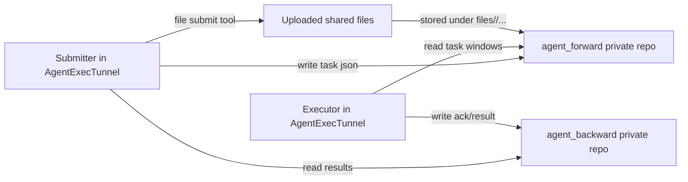
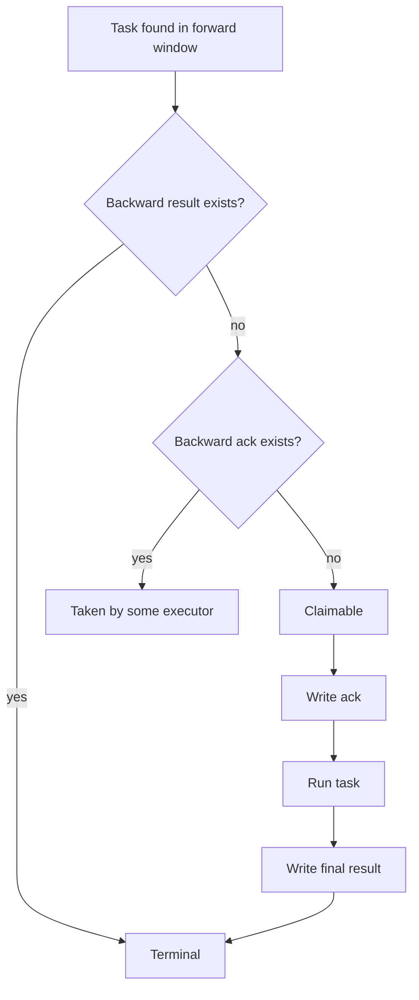

# Design

## Overview

`AgentExecTunnel` is the public control repository. It coordinates two private data repositories:

- `agent_forward`
- `agent_backward`

`agent_forward` carries tasks and shared uploaded files.

`agent_backward` carries ACKs and final results. Backward is the only authority for completion state.

## Sync Model

Rules:

- submitter never writes backward
- executor never writes forward
- task submit and file submit are independent
- completion is determined only from backward results

## State Update Model

Rules:

- no result + no ack: claimable
- ack only: already taken, do not re-run
- result exists: terminal
- there is no `stale` state in this protocol

## Windows

- steady-state scan window: recent 6 hours
- startup catch-up window: recent 72 hours

Executor scans only these buckets. This keeps scan cost bounded as history grows.

## Files

Shared uploaded files live in:

- `forward/files/<user_name>/...`

Task JSONs do not reference these files as protocol objects. They are an independent shared material channel.
